<div align="center">

# Claude Code Hooks

**Protect your codebase and enhance Claude Code with safety guardrails, standard enforcement, and context injection.**

[](https://github.com/nightshift2k/claude-code-hooks/blob/main/LICENSE)
[](https://www.python.org/)
[](https://github.com/nightshift2k/claude-code-hooks/releases)
[](https://github.com/nightshift2k/claude-code-hooks/stargazers)
[](https://github.com/nightshift2k/claude-code-hooks/issues)
[](https://github.com/nightshift2k/claude-code-hooks/commits)

[](https://github.com/nightshift2k/claude-code-hooks/actions/workflows/lint.yml)
[](https://github.com/nightshift2k/claude-code-hooks/pulls)
[](https://conventionalcommits.org)
[](https://github.com/astral-sh/ruff)

</div>

---

## How It Works

```mermaid
graph LR
    A[👤 User Action] --> B{🎣 Hook Event}
    B --> C[📜 Hook Script]
    C -->|Exit 0| D[✅ Allow]
    C -->|Exit 2| E[🚫 Block]
    D --> F[🤖 Claude Executes]
    E --> G[⚠️ User Notified]
```



---

## Quick Start

### 1. Copy Hooks

```bash
cp -r hooks/* ~/.claude/hooks/
```

### 2. Make Executable

```bash
chmod +x ~/.claude/hooks/*.py
```

### 3. Merge Settings

Merge the hook configurations from `settings.json.example` into your `~/.claude/settings.json` file.

---

## Features

### 🛡️ Safety & Guardrails

| Hook | Event | Description |
|------|-------|-------------|
| `git-branch-protection.py` | PreToolUse (Edit/Write/Bash) | Blocks file edits on protected branches; analyzes bash commands for file-writing patterns |
| `git-safety-check.py` | PreToolUse (Bash) | Blocks `--no-verify`, protected branch deletion |
| `git-commit-message-filter.py` | PreToolUse (Bash) | Blocks Claude auto-generated attribution in commits |
| `doc-update-check.py` | PreToolUse (Bash) | Blocks merge-to-main without documentation updates |
| `changelog-reminder.py` | PreToolUse (Bash) | Blocks commits without CHANGELOG.md when meaningful files changed |
| `release-check.py` | PreToolUse (Bash) | Blocks git tag if version not in CHANGELOG.md |
| `python-uv-enforcer.py` | PreToolUse (Bash) | Enforces `uv` over direct pip/python usage |
| `large-file-guard.py` | PreToolUse (Read) | Blocks reading large files (>500 lines), suggests Serena/Grep alternatives |

### 📝 Context & Prompts

| Hook | Event | Description |
|------|-------|-------------|
| `environment-awareness.py` | SessionStart | Injects date, time, timezone, OS, and working directory |
| `large-file-awareness.py` | SessionStart | Scans project at session start, injects awareness of large files (>500 lines) to enable efficient navigation strategies (Serena, Grep, Read offset/limit) |
| `serena-awareness.py` | UserPromptSubmit | Detects Serena-configured projects on first prompt, suggests activate_project or onboarding |
| `rules-reminder.py` | SessionStart, UserPromptSubmit | Reminds Claude about CLAUDE.md and .claude/rules/* |
| `release-reminder.py` | UserPromptSubmit | Reminds about release verification checklist when release keywords detected |
| `prompt-flag-appender.py` | UserPromptSubmit | Injects markdown via TOML-defined triggers with alias support and project overrides |

### 🔧 Shared Utilities

| File | Description |
|------|-------------|
| `hook_utils.py` | Shared utilities: `exit_if_disabled()`, `Colors`, `classify_file()`, `estimate_tokens()`, `count_lines()` |

---

## Hook Event Architecture


---

## Disabling Hooks Per-Project

Create `.claude/disabled-hooks` in your project root:

```
# Disable uv enforcement for legacy Python project
python-uv-enforcer

# Allow edits on main for initial setup
git-branch-protection

# Skip doc check during rapid prototyping
doc-update-check

# Skip changelog check for non-release branches
changelog-reminder

# Skip release checks for non-release projects
release-check
release-reminder

# Allow reading large files for data exploration
large-file-guard
```

Lines starting with `#` are comments.

---

## Hook Documentation

<details>
<summary><b>git-branch-protection.py</b></summary>

### git-branch-protection.py

Prevents accidental edits on protected branches and analyzes bash commands for file-writing operations.

#### Edit/Write Tool Behavior (Blocked)

Direct file modifications via Edit or Write tools are blocked on protected branches:

```
$ edit file on main branch
❌ Cannot edit files on protected branch 'main'!
📝 Create a feature branch first:
   git checkout -b feature/your-feature-name
💡 Or disable this hook:
   echo "git-branch-protection" >> .claude/disabled-hooks
```

#### Bash Command Behavior (Reflective Analysis)

When bash commands contain potential file-writing patterns, the hook outputs a reflective question instead of blocking:

```
$ sed -i 's/foo/bar/' config.txt  # on main branch
⚠️ Potential file-writing command detected on protected branch 'main'

Command: sed -i 's/foo/bar/' config.txt

📝 Before proceeding, verify:
   Does this command actually write to files?
   If yes, create a feature branch first.
```

**Detected patterns:**
- In-place editing: `sed -i`, `perl -i`
- File redirection: `>`, `>>`
- Tee operations: `tee` (excluding `/dev/null`, `/dev/stdout`, `/dev/stderr`)
- Heredocs: `<<`, `<<-`

**Safe patterns (excluded):**
- Redirection to `/dev/null`, `/dev/stdout`, `/dev/stderr`
- Read-only commands (grep, cat, ls, etc.)

**Protected branches:** main, master, production, prod

**Design rationale:** Bash commands use reflective analysis rather than blocking to reduce false positives while still promoting awareness of file-writing operations on protected branches.

</details>

<details>
<summary><b>git-safety-check.py</b></summary>

### git-safety-check.py

Blocks dangerous git operations.

```
$ git commit --no-verify
❌ Using --no-verify to skip Git hooks is prohibited!

$ git branch -D main
❌ Blocked: Cannot delete protected branch 'main'
```

</details>

<details>
<summary><b>git-commit-message-filter.py</b></summary>

### git-commit-message-filter.py

Blocks commits with Claude auto-generated markers.

```
$ git commit -m "Fix bug\n\n🤖 Generated with Claude Code..."
❌ Commit message contains auto-generated Claude markers. Please use a custom commit message.
```

</details>

<details>
<summary><b>doc-update-check.py</b></summary>

### doc-update-check.py

Ensures documentation is updated when merging to main.

```
$ git merge feature-branch  # on main branch
❌ No documentation updates detected in this branch.

📝 Files checked: CHANGELOG.md, README.md, *.md (excluding .doc-check-ignore patterns)

💡 Options:
   1. Update relevant documentation, then retry merge
   2. If no docs needed, ask user to confirm, then run:
      SKIP_DOC_CHECK=1 git merge <branch>

🔍 Branch diff: git diff main...HEAD --name-only
```

**Detection Modes:**
- **Regex (default):** Fast, pattern-based detection
- **AI Mode (opt-in):** Uses Claude Haiku for semantic understanding

**Enable AI Mode:**
```bash
# Per-command
DOC_CHECK_USE_AI=1 git merge feature-branch

# Per-project (persistent)
touch .claude/hook-doc-check-ai-mode-on
```

AI mode is useful for complex merge scenarios where regex patterns may fail.

**Detects merge-to-main via:**
- `git merge` while on main branch
- `git checkout main && git merge` command chains
- `gh pr merge` operations

**Skip conditions:**
- `SKIP_DOC_CHECK=1` environment variable
- Hook disabled via `.claude/disabled-hooks`
- `.doc-check-ignore` patterns (optional)

**Example `.doc-check-ignore`:**
```
# Exclude planning and brainstorming
docs/plans/**
docs/brainstorms/**

# Exclude temporary files
*-todo.md
*-scratch.md
*-draft.md
```

</details>

<details>
<summary><b>changelog-reminder.py</b></summary>

### changelog-reminder.py

Ensures CHANGELOG.md is updated when committing meaningful code changes.

```
$ git commit -m "Add new feature"
❌ Meaningful changes without CHANGELOG.md update!

📝 Staged files requiring changelog:
   - hooks/new-hook.py
   - src/utils.py

💡 Options:
   1. Update CHANGELOG.md, then retry commit
   2. SKIP_CHANGELOG_CHECK=1 git commit ...
```

**Meaningful files include:**
- Production code (hooks/, src/, lib/, etc.)
- Configuration files (pyproject.toml, package.json, etc.)

**Non-meaningful files (excluded):**
- Test files (tests/*)
- GitHub workflows (.github/*)
- Python cache (__pycache__, *.pyc)
- Documentation (*.md)
- Configuration (.gitignore, conftest.py)
- Claude directory (.claude/*)

**Skip conditions:**
- `SKIP_CHANGELOG_CHECK=1` environment variable (inline or in command)
- Hook disabled via `.claude/disabled-hooks`
- Only non-meaningful files staged
- CHANGELOG.md already staged

**Use cases:**
- Enforce changelog updates for all production code changes
- Skip for documentation-only commits
- Skip for test-only commits
- Manual bypass for special cases (e.g., committing the hook itself)

</details>

<details>
<summary><b>release-reminder.py</b></summary>

### release-reminder.py

Reminds about release verification steps when release-related keywords are detected in user prompts.

```
$ "prepare a release for v0.1.4"
---
## Release Verification Required

Before tagging/releasing, ensure:
1. CHANGELOG.md has version section matching the release (not just [Unreleased])
2. All version files are synchronized (check project-specific: pyproject.toml, package.json, etc.)
3. Working tree is clean
4. You're on the correct branch

Confirm these checks before proceeding with git tag.
---
```

**Trigger keywords:**
- `release`
- `tag v`
- `version bump`
- `prepare release`
- Version patterns like `v0.1.`, `v0.2.`, `v1.0.`, etc.

**Hook behavior:**
- Outputs reminder only when keywords detected
- Silent for non-release prompts
- Works in conjunction with `release-check.py` for comprehensive release safety

**Use cases:**
- Prevent forgotten changelog updates before releases
- Ensure version synchronization across files
- Remind about clean working tree requirements
- Pre-flight checklist for release operations

</details>

<details>
<summary><b>release-check.py</b></summary>

### release-check.py

Blocks git tag operations when version is not documented in CHANGELOG.md.

```
$ git tag v0.1.4
❌ Version 0.1.4 not found in CHANGELOG.md!

📝 Before tagging, update CHANGELOG.md:
   - Rename [Unreleased] section to [0.1.4]
   - Add release date

💡 Bypass: SKIP_RELEASE_CHECK=1 git tag v0.1.4
```

**Version detection:**
- Extracts version from `git tag v*` commands
- Supports annotated tags: `git tag -a v1.2.3 -m "message"`
- Simple string search in CHANGELOG.md

**Skip conditions:**
- `SKIP_RELEASE_CHECK=1` environment variable (inline or in command)
- Hook disabled via `.claude/disabled-hooks`
- CHANGELOG.md doesn't exist (allows tags for projects without changelog)
- Tags without 'v' prefix (e.g., `git tag 1.2.3`)

**Use cases:**
- Prevent releasing versions without changelog entries
- Enforce documentation before tagging
- Safety net for release automation
- Works best with Keep a Changelog format

**Projects without CHANGELOG.md:**
If your project doesn't use CHANGELOG.md, the hook will automatically allow tags (fail-open behavior).

</details>

<details>
<summary><b>python-uv-enforcer.py</b></summary>

### python-uv-enforcer.py

Enforces modern Python tooling.

```
$ pip install requests
❌ Direct Python tool usage detected!
📝 Command blocked: pip install requests
✨ Use uv instead:
   uv pip install ...
💡 Learn more: https://github.com/astral-sh/uv
```

</details>

<details>
<summary><b>large-file-guard.py</b></summary>

### large-file-guard.py

Blocks reading large files to protect Claude's context window.

```
$ [Read tool on 625-line file]
❌ Large file: tests/test_large_file_guard.py (625 lines, ~6,379 tokens est.)

📝 Alternatives: Serena find_symbol • Grep patterns • Read offset/limit

💡 Bypass: ALLOW_LARGE_READ=1
```

**Two-stage size detection:**
- **< 5KB**: Instant allow (skip line counting)
- **5-100KB**: Accurate line counting
- **> 100KB**: Instant block with estimated lines

**Context-aware suggestions:**
- **Code files** (.py, .js, .ts, etc.): Suggests Serena `find_symbol`
- **Data files** (.json, .yaml, .csv): Suggests Grep patterns (no Serena)

**Configuration:**
```bash
# Set custom threshold (default: 500 lines)
export LARGE_FILE_THRESHOLD=1000

# Or use config file
echo "1000" > ~/.claude/hook-large-file-guard-config

# Bypass for single read
ALLOW_LARGE_READ=1 claude
```

**Skip conditions:**
- Binary files (.png, .pdf, .zip, etc.)
- Reads with `offset` or `limit` parameters (targeted reads)
- `ALLOW_LARGE_READ=1` environment variable

</details>

<details>
<summary><b>environment-awareness.py</b></summary>

### environment-awareness.py

Injects system environment context at session start and resume.

```
## Environment
- Date: 2025-12-14 (Saturday)
- Time: 14:32 CET
- OS: macOS 15.1
- Directory: ~/code/my-project
```

</details>

<details>
<summary><b>rules-reminder.py</b></summary>

### rules-reminder.py

Reminds Claude to check project rules on:
- Session start/resume (always)
- User prompts containing implementation keywords (implement, fix, refactor, design, etc.)

```
## Project Rules Reminder

This project may have rules defined in:
- CLAUDE.md (project root and .claude/ directory)
- .claude/rules/* (rule files)

Review and follow all project rules strictly before making changes.
```

</details>

<details>
<summary><b>prompt-flag-appender.py</b></summary>

### prompt-flag-appender.py

Appends markdown fragments based on trigger words or session modes. Configuration is stored in a single TOML file with support for aliases and project-level overrides.

#### Built-in Triggers

| Trigger | Aliases | Effect |
|---------|---------|--------|
| `+ultrathink` | - | Deep analysis mode |
| `+absolute` | - | Direct, no-filler responses |
| `+approval` | - | Human-in-the-loop mode (propose, don't execute) |
| `+sequential-thinking` | `+seqthi` | Invoke sequential thinking MCP |

**Usage:**
```
refactor this code +ultrathink
help me understand this +absolute
implement feature +approval
complex task +seqthi
```

#### TOML Configuration

Triggers are defined in `prompt-flag-appender.toml`:

```toml
# ~/.claude/hooks/prompt-flag-appender.toml (system)
# $CLAUDE_PROJECT_DIR/.claude/prompt-flag-appender.toml (project override)

[ultrathink]
aliases = []
content = """
ULTRATHINK MODE ACTIVATED
...
"""

[sequential-thinking]
aliases = ["seqthi", "seq"]
content = """
Use mcp__sequential-thinking__sequentialthinking for this analysis.
"""

[custom-trigger]
aliases = ["ct", "custom"]
content = """
Your custom prompt injection here...
"""
```

#### Project Overrides

Create a project-specific TOML file to add or override triggers:

```bash
# Create project-level config
cat > .claude/prompt-flag-appender.toml << 'EOF'
[project-mode]
aliases = ["pm"]
content = """
Follow project-specific guidelines...
"""

# Override system trigger
[ultrathink]
aliases = ["think", "deep"]
content = """
Custom ultrathink for this project...
"""
EOF
```

**Merge behavior:** Project config merges with system config. Project entries override system entries with the same name.

#### Session-Based Modes

Enable modes for the entire session via flag files in the project's `.claude/` directory:

```bash
# Enable approval mode for entire session (in project root)
touch .claude/hook-approval-mode-on

# Now every prompt includes approval mode fragment
# No need to add +approval to each prompt

# Disable approval mode
rm .claude/hook-approval-mode-on
```

**Mode resolution:** Mode names resolve through the TOML trigger system, including aliases. `hook-seq-mode-on` resolves via alias to `sequential-thinking`.

**Mode precedence:** Session modes are injected first, then per-prompt triggers are appended.

#### Always-On Injection

Use the special `[_always]` section to inject content on **every prompt**, before any mode or trigger fragments:

```toml
# In ~/.claude/hooks/prompt-flag-appender.toml or .claude/prompt-flag-appender.toml

[_always]
content = """
Remember: Follow the project's coding standards.
Check CLAUDE.md before making changes.
"""
```

**Injection order:** `[_always]` → Session modes → Per-prompt triggers

**Use cases:**
- Persistent project-specific instructions
- Default behavior modifiers
- Always-on safety reminders

#### Adding Custom Triggers

Add triggers to your system or project TOML file:

```toml
# In ~/.claude/hooks/prompt-flag-appender.toml or .claude/prompt-flag-appender.toml

[verbose]
aliases = ["v", "detailed"]
content = """
## Verbose Mode
Provide detailed explanations with step-by-step reasoning.
"""
```

Now `+verbose`, `+v`, and `+detailed` all inject the same content.

</details>

<details>
<summary><b>serena-awareness.py</b></summary>

### serena-awareness.py

Detects Serena-configured projects on first prompt in a session and suggests MCP integration.

#### Detection States

| State | Indicators | Output |
|-------|------------|--------|
| Configured | `.git/` + `.serena/project.yml` with `project_name` | Suggests `activate_project` |
| Code Project | `.git/` + code files (no Serena) | Suggests `onboarding` |
| Not a Project | No `.git/` | Silent |

#### Example Output

**Configured project:**
```
## Serena Project Detected
.serena/ with project "my-project" found.
Configured languages: python, typescript
If Serena MCP is available: `activate_project`
```

**Code project (unconfigured):**
```
## Code Project Detected
Detected languages: Python, TypeScript, JavaScript
If Serena MCP is available, consider `onboarding` for semantic code navigation.
```

#### Aggressive Mode

For stricter Serena enforcement, enable aggressive mode:

```bash
# Per-session (environment variable)
SERENA_AGGRESSIVE_MODE=1 claude

# Per-project (flag file)
touch .claude/hook-serena-awareness-aggressive-on
```

Aggressive mode uses prescriptive language that REQUIRES Serena MCP for code exploration:

```
## Serena Project Active
Project: my-project (python)

<MANDATORY>
**Serena MCP is REQUIRED for all code exploration in this project.**

DO:
- `find_symbol` for locating classes, functions, methods
- `get_symbols_overview` for file structure
- `find_referencing_symbols` for usage/callers

DO NOT:
- Grep for function/class definitions
- Glob for finding code files by pattern
- Read entire files to find symbols
</MANDATORY>
```

#### Session Tracking

Uses marker files in `.claude/hook_serena_awareness_session_markers/` to track seen sessions:
- Only outputs on first prompt per session
- Self-cleaning: removes markers older than 7 days
- Project-local storage (not global)

#### Language Detection

Detects 30+ programming languages by scanning project root and `src/` directories. Uses `FilenameMatcher` patterns from `hook_utils.py`.

</details>

<details>
<summary><b>large-file-awareness.py</b></summary>

### large-file-awareness.py

Scans project at session start and injects awareness of large files (>500 lines) to enable efficient navigation from the beginning.

#### Example Output

```
## Large Files (symbolic navigation required)
tests/test_doc_update_check.py (1081 lines, ~12702 tokens) → Serena
tests/test_serena_awareness.py (872 lines, ~9199 tokens) → Serena
README.md (804 lines, ~6447 tokens) → Read offset/limit
tests/test_large_file_awareness.py (725 lines, ~7002 tokens) → Serena
(+5 more files over 500 lines)

Action: find_symbol for code, Read offset/limit for sections.
```

#### Tool Recommendations

| File Type | Recommended Tool | Examples |
|-----------|------------------|----------|
| Code | Serena `find_symbol` | `.py`, `.ts`, `.go`, `.rs` |
| Data | Grep patterns | `.json`, `.yaml`, `.csv` |
| Text | Read offset/limit | `.md`, `.txt` |
| Binary | (skipped) | `.png`, `.pdf`, `.zip` |

#### File Discovery

1. **Git projects**: Uses `git ls-files` (respects `.gitignore`)
2. **Non-git**: Falls back to `os.walk` with standard excludes

**Standard excludes:** `.git`, `node_modules`, `__pycache__`, `.venv`, `vendor`, `dist`, `build`, `.next`, `target`

#### Configuration

```bash
# Set custom threshold (default: 500 lines)
export LARGE_FILE_THRESHOLD=1000

# Or via settings.json: {"hooks": {"largeFileThreshold": 1000}}
```

#### Defense-in-Depth

Works alongside `large-file-guard.py`:
- **Awareness** (this hook): Proactive warning at session start
- **Guard**: Blocks actual Read operations on large files

</details>

---

## Configuration

<details>
<summary><b>settings.json Structure</b></summary>

### settings.json Structure

```json
{
  "hooks": {
    "SessionStart": [
      {
        "matcher": "startup|resume",
        "hooks": [
          {"type": "command", "command": "~/.claude/hooks/environment-awareness.py"},
          {"type": "command", "command": "~/.claude/hooks/large-file-awareness.py"},
          {"type": "command", "command": "~/.claude/hooks/rules-reminder.py"}
        ]
      }
    ],
    "UserPromptSubmit": [
      {
        "hooks": [
          {"type": "command", "command": "~/.claude/hooks/prompt-flag-appender.py"},
          {"type": "command", "command": "~/.claude/hooks/serena-awareness.py"},
          {"type": "command", "command": "~/.claude/hooks/rules-reminder.py"},
          {"type": "command", "command": "~/.claude/hooks/release-reminder.py"}
        ]
      }
    ],
    "PreToolUse": [
      {
        "matcher": "Bash",
        "hooks": [
          {"type": "command", "command": "~/.claude/hooks/git-commit-message-filter.py"},
          {"type": "command", "command": "~/.claude/hooks/python-uv-enforcer.py"},
          {"type": "command", "command": "~/.claude/hooks/git-safety-check.py"},
          {"type": "command", "command": "~/.claude/hooks/doc-update-check.py"},
          {"type": "command", "command": "~/.claude/hooks/changelog-reminder.py"},
          {"type": "command", "command": "~/.claude/hooks/release-check.py"},
          {"type": "command", "command": "~/.claude/hooks/git-branch-protection.py"}
        ]
      },
      {
        "matcher": "^(Edit|Write)$|mcp__morphllm.*|mcp__serena.*(replace|insert).*",
        "hooks": [
          {"type": "command", "command": "~/.claude/hooks/git-branch-protection.py"}
        ]
      },
      {
        "matcher": "^(Read)$",
        "hooks": [
          {"type": "command", "command": "~/.claude/hooks/large-file-guard.py"}
        ]
      }
    ]
  }
}
```

### Hook Output Behavior

| Event | stdout behavior |
|-------|-----------------|
| SessionStart | Injected as context |
| UserPromptSubmit | Injected as context |
| PreToolUse | Shown in verbose mode only |

| Exit code | Effect |
|-----------|--------|
| 0 | Success (stdout processed per event type) |
| 2 | Block action, show stderr as error |
| 1/other | Non-blocking, stderr shown in verbose mode |

### Environment Variables

| Variable | Description |
|----------|-------------|
| `CLAUDE_PROJECT_DIR` | Project root directory |
| `CLAUDE_CODE_REMOTE` | "true" if web, empty if CLI |
| `SKIP_DOC_CHECK` | "1" to bypass doc-update-check hook |
| `SKIP_CHANGELOG_CHECK` | "1" to bypass changelog-reminder hook |
| `SKIP_RELEASE_CHECK` | "1" to bypass release-check hook |
| `DOC_CHECK_USE_AI` | "1" to enable AI-powered merge detection |
| `LARGE_FILE_THRESHOLD` | Override large file threshold (default: 500 lines) |
| `ALLOW_LARGE_READ` | "1" to bypass large-file-guard for single read |
| `SERENA_AGGRESSIVE_MODE` | "1" to enable prescriptive Serena enforcement |

</details>

---

## Development

<details>
<summary><b>Adding a New Hook</b></summary>

### Adding a New Hook

1. Create `hooks/your-hook.py`:

```python
#!/usr/bin/env python3
"""Your Hook - Description."""

import json
import sys
from typing import Dict, Any

from hook_utils import exit_if_disabled, Colors


def main() -> None:
    exit_if_disabled()

    try:
        input_data: Dict[str, Any] = json.load(sys.stdin)
        # Your logic here
        sys.exit(0)
    except Exception:
        sys.exit(0)  # Silent failure


if __name__ == "__main__":
    main()
```

2. Make executable: `chmod +x hooks/your-hook.py`
3. Add to `settings.json.example`
4. Test: `echo '{"tool_name": "Bash", "tool_input": {"command": "test"}}' | python3 your-hook.py`

</details>

<details>
<summary><b>Running Tests</b></summary>

### Running Tests

```bash
# Run all tests
uv run pytest tests/ -v

# Run with coverage
uv run pytest tests/ --cov=hooks

# Run specific test file
uv run pytest tests/test_git_safety_check.py -v
```

</details>

<details>
<summary><b>Testing Hooks</b></summary>

### Testing Hooks

```bash
# Test PreToolUse hook
echo '{"tool_name": "Bash", "tool_input": {"command": "pip install foo"}}' | python3 python-uv-enforcer.py

# Test UserPromptSubmit hook
echo '{"hook_event_name": "UserPromptSubmit", "prompt": "implement feature"}' | python3 rules-reminder.py

# Test SessionStart hook
echo '{"hook_event_name": "SessionStart"}' | python3 rules-reminder.py

# Test doc-update-check hook
echo '{"tool_name": "Bash", "tool_input": {"command": "git merge feature"}}' | python3 doc-update-check.py

# Test changelog-reminder hook
echo '{"tool_name": "Bash", "tool_input": {"command": "git commit -m 'Add feature'"}}' | python3 changelog-reminder.py

# Test release-reminder hook
echo '{"hook_event_name": "UserPromptSubmit", "prompt": "prepare release v0.1.4"}' | python3 release-reminder.py

# Test release-check hook
echo '{"tool_name": "Bash", "tool_input": {"command": "git tag v0.1.4"}}' | python3 release-check.py

# Test prompt-flag-appender with triggers
echo '{"hook_event_name": "UserPromptSubmit", "prompt": "fix this +ultrathink +approval"}' | python3 prompt-flag-appender.py

# Test prompt-flag-appender with session mode
mkdir -p .claude && touch .claude/hook-approval-mode-on
CLAUDE_PROJECT_DIR="$PWD" echo '{"hook_event_name": "UserPromptSubmit", "prompt": "fix this"}' | python3 prompt-flag-appender.py
rm .claude/hook-approval-mode-on
```

</details>

---

<div align="center">

## Project Activity

[](https://star-history.com/#nightshift2k/claude-code-hooks&Date)

## Contributors

[](https://github.com/nightshift2k/claude-code-hooks/graphs/contributors)

## License

[MIT License](https://github.com/nightshift2k/claude-code-hooks/blob/main/LICENSE)

</div>
